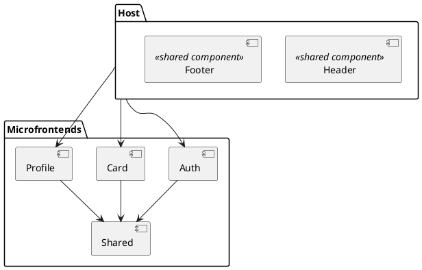

# Задание 1: Спецификация по миграции монолитного фронтенда Mesto на микрофронтенды

- [Контекст](#контекст)
- [Методика](#методика)
- [Реализация](#реализация)
- [Запуск кода](#запуск-кода)

## Контекст

Текущее приложение построено как монолитное приложение выделенным бэкендом и
тесно связанным фронтендом. Фронтенд разбит на переиспользуемые блоки (
auth-form, card, header, footer и т. д.). Это ограничивает независимую
разработку, развертывание и масштабируемость.

Для устранения этих ограничений предлагаю перейти к архитектуре микрофронтендов,
в которой каждый блок или компонент, специфичный для конкретного домена (
например, аутентификация, карточка, профиль), будет разбит на независимые
микрофронтенды. Это позволит создать более масштабируемые, поддерживаемые и
независимо развертываемые части.

Основным мотивом для такого перехода является достижение лучшей модульности,
параллельных потоков разработки и уменьшение связи между различными командами,
работающими над фронтендом.

## Методика

Для перехода от монолитного фронтенда к микрофронтендам мы реализуем *
*хост-приложение**, которое динамически загружает отдельные микрофронтенды через
**Webpack Module Federation**. Такой подход обеспечит независимую разработку,
развертывание и масштабирование каждого приложения, но при этом позволит им
совместно использовать код и ресурсы.

## Реализация

Архитектура будет состоять из **хост-приложения**, отвечающего за загрузку и
компоновку микрофронтендов во время выполнения. Каждый микрофронтенд будет
представлять свой собственный пользовательский интерфейс и функциональные
возможности через Webpack Module Federation, обеспечивая модульность и
разделение проблем.



**Host**

Это основной координирующий модуль, который отвечает за:

* Загрузку и отображение микрофронтендов.
* Общие компоненты, такие как Header, Footer и глобальный контекст.
* Управление навигацией между микрофронтендами и предоставление общей
  инфраструктуры для контекстов (например, состояние авторизации).

**Микрофронтенды:**

* Auth: Модуль для регистрации и авторизации пользователя.
* Profile: Модуль для редактирования профиля и обновления аватара.
* Card: Модуль для управления карточками (создание, редактирование,
  удаление, лайки).
* Shared: Общий модуль для переиспользуемых компонентов (попап).

Каждый микрофронтенд будет независимым приложением с возможностью развертывания
и разработки автономно.

**Общие библиотеки**

Чтобы избежать дублирования и большого размера бандлов, такие библиотеки, как
React, будут конфигурироваться как синглтоны в Webpack Module Federation. Это
позволит избежать дублирования и обеспечит единую версию библиотек во всех
приложениях.

## Запуск кода

Перед запуском кода убедитесь, что команды выполняются в корне проекта Host.

```bash
  cd frontend/microfrontends/host
```

### 1. Установка зависимостей

#### Установка всех зависимостей сразу:

Выполните следующую команду для установки зависимостей во всех приложениях (Host
и микрофронтенды):

```bash
  npm install:all
```

---

### 2. Запуск всех приложений

#### Одновременный запуск всех микрофронтендов:

Для запуска Host и всех микрофронтендов выполните:

```bash
npm run start:all
```

# Задание 2: Декомпозиция веб-приложения на Django на микросервисы


